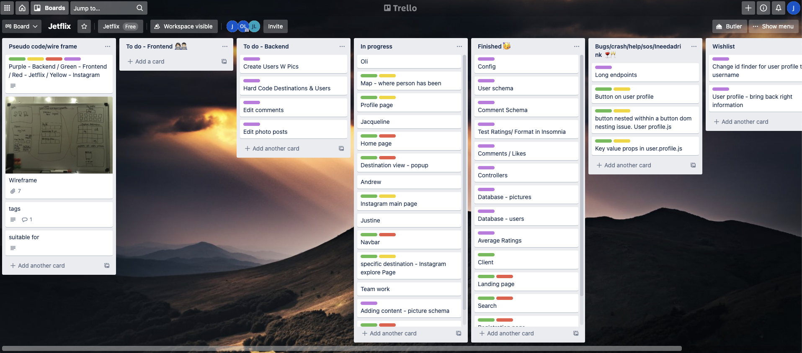
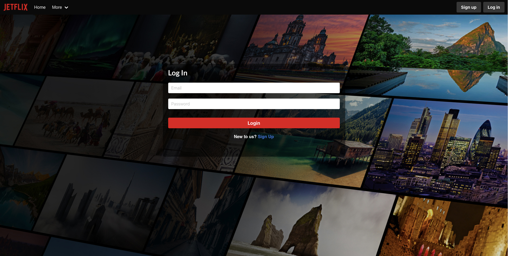
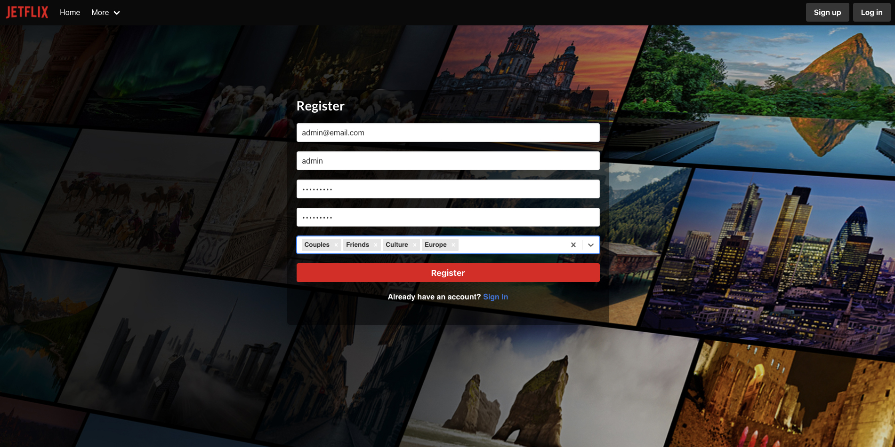
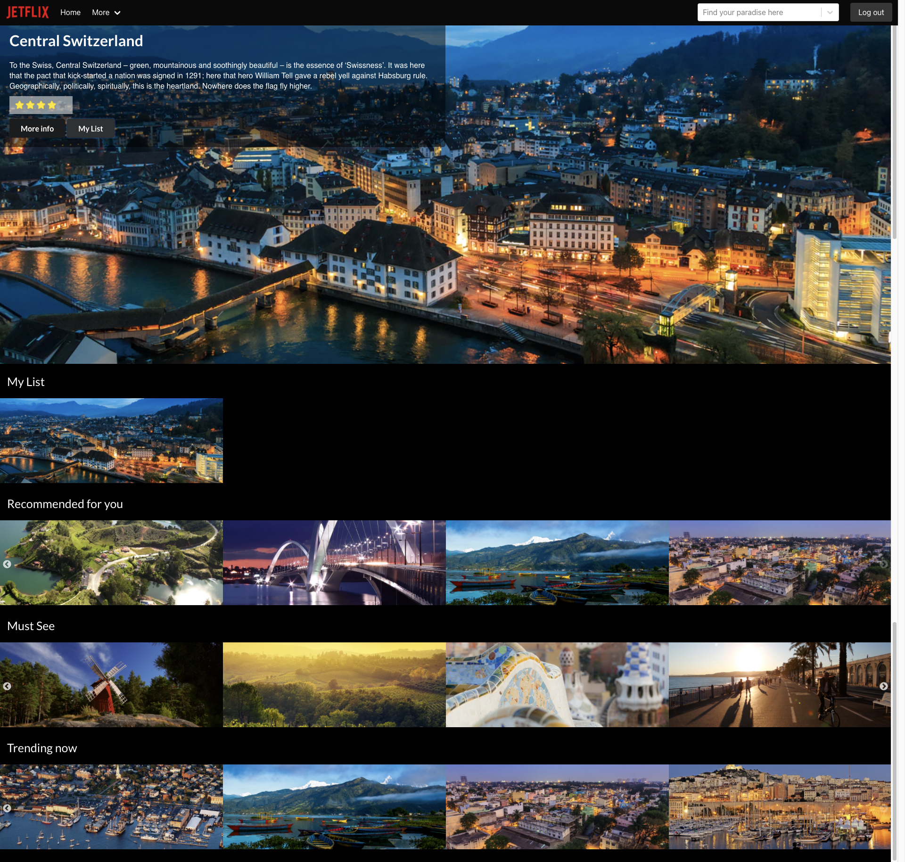
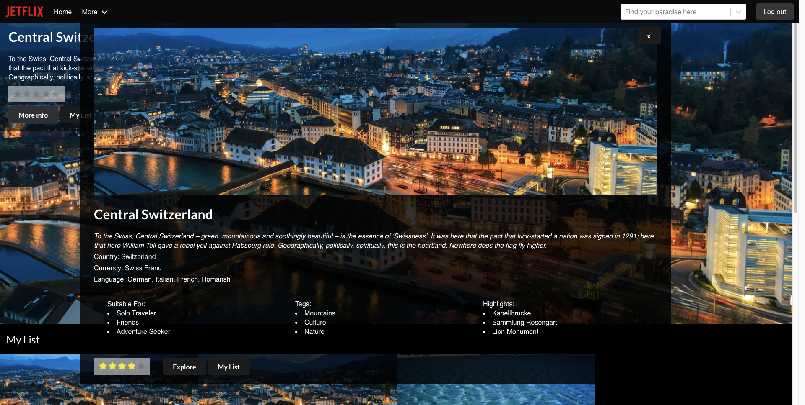

# General Assembly Project 3: Jetflix

----
# Group Members:
* Justine Solano: https://github.com/justinesolano
* Jacqueline de Leeuw: https://github.com/jacquelinedeleeuw
* Oliver Lewis: https://github.com/olilewis1
* Andrew Ogilvy: https://github.com/aogilvy10

 
# Table of Contents
* Project Brief
* Project Description
* Technologies & Installation
* Process
  - Planning
  - Backend
  - Frontend
* Final Walkthrough
* Wins & bugs
* Extra Features
 
## Project Brief:
* **Build a full-stack application** by making your own backend and your own front-end
* **Use an Express API** to serve your data from a Mongo database
* **Consume your API with a separate front-end** built with React
* **Be a complete product** which most likely means multiple relationships and CRUD functionality for at least a couple of models
* **Implement thoughtful user stories/wireframes** that are significant enough to help you know which features are core MVP and which you can cut
* **Have a visually impressive design** to kick your portfolio up a notch and have something to wow future clients & employers. **ALLOW** time for this.
* **Be deployed online** so it's publicly accessible.
 
## Timeframe:
8 Days
 
## Description
Jetflix is a Netflix/Instagram inspired project. It is an app that aims to help users find a holiday/getaway using the destinations in the database. The destinations included are cities, towns and tourist spots. Users can also register with the site, favourite specific destinations, and post pictures of destinations they've been to and tag them with the location. These posts appear on the Explore page but only as the image, user owner and location. There is also a Feed page which shows activity of all users, such as their recent posts, recent likes, and recent comments.
 
### Deployed version:
https://jetflix-app.herokuapp.com/
 
To explore the app, use these login credentials:
<b>email</b>: admin@email.com <br />
<b>password</b>: adminpass
 
## Technologies used
### Frontend:
- React
- Axios
- Semantic UI React
- Semantic UI
- Bulma
- SASS
- HTTP-proxy-middleware
- React Router DOM
### Backend:
- Node
- MongoDB
- Mongoose
- Express
- Bcrypt
- jsonwebtoken
### Development tools:
- VSCode
- Insomnia
- Yarn
- Git & GitHub
- Google Chrome development tools
- Trello Board (planning)
- Adobe Photoshop 2021 (assets)
- Cloudinary
- Heroku (deployment)
 
## Installation
Clone or download sei-project-three repo then run these in Terminal:
* `mongod —dbpath ~/data/db` to run Mongo
* Open project and `yarn` to install yarn packages
* Split terminals in project
* `cd backend` in first Terminal to go into backend directory
* `yarn seed` to seed database
* `yarn serve` to run server
* `cd client` in second Terminal to go into frontend directory
* `yarn start` to start front-end server
* go to localhost:3000 in browser to see app
 
# PROCESS
## PLANNING (day 1)
### Concept
The base idea for Jetflix was the group's shared interest for travel. We thought it would be a good idea to make a travel app for users to browse for holiday destinations after COVID-19. We thought it would be a cool challenge to make a clone of an existing website. We picked Netflix because of it's browsing-based structure and we wanted to remake this with travel destinations instead of TV shows/movies. To give our app a distinguishing aspect from Netflix, we decided to incorporate an Instagram-based element. We wanted users to be able to share their travel pictures with each other and interact with these posts to maximise the app's ability to heighten social connections.
 
### Storyboard/Wireframes

 
### Trello Organisation

 
Because there were so many components that were involved in our project and four of us, we used Trello to organize the project into smaller components. We decided to set up the backend together and then tackle the frontend individually by delegating different parts to each group member. We knew that the scale of the project was the biggest we'd done yet, not to mention that our idea to do a Netflix/Instagram-inspired app was already a lot of work to undertake. We stayed on Zoom each day from beginning to end so that we could quickly communicate any problems or questions we had, also frequently needing to use screen share. We also used Slack extensively to send each other code snippets/project assets.
 
## BACKEND (day 2)
### Setup
We created the backend together so there was no confusion about any of the models and the database. We created the backend using Mongoose and tackling it as a group made the process less complicated. One person typed and we used the Live Share extension pack so we could all see the progress on VSCode. Doing this also helped to see whether there was anything missing in the code that maybe other group members had missed and made debugging errors faster.
 
In terms of our API, we tried to find one that had a more comprehensive detail for each destination such as language, currency, key spots etc. Many of the APIs we found online were not free and/or not matching the details we wanted. We ended up creating our own API using destinations from https://www.lonelyplanet.com/, including using the website's images and descriptions.
 
We had two schemas: one for users and a second for main destinations.
 
The `userSchema` had an embedded `photoSchema` which in turn has two embedded schemas(`commentSchema` and `likesSchema`):
```javascript
const likesSchema = new mongoose.Schema({
 like: { type: Boolean, required: true },
 owner: { type: mongoose.Schema.ObjectId, ref: 'User', required: true },
})
 
const commentSchema = new mongoose.Schema({
 text: { type: String, required: true, maxlength: 300 },
 owner: { type: mongoose.Schema.ObjectId, ref: 'User', required: true },
}, {
 timestamps: true,
})
 
const photoSchema = new mongoose.Schema({
 title: { type: String, required: true },
 location: { type: Object },
 image: { type: String, required: true },
 locationName: { type: String, required: true },
 comments: [commentSchema],
 likes: [likesSchema],
}, {
 timestamps: true,
})
 
const userSchema = new mongoose.Schema({
 username: { type: String, required: true, unique: true, maxlength: 40 },
 email: { type: String, required: true, unique: true },
 password: { type: String, required: true },
 photos: [photoSchema],
 myList: { type: Array, unique: true },
 myTags: { type: Array, unique: true },
})
```
 
This means that only authenticated users can post photos, and like and comment on these posts. The userSchema also has a `myList` field which allows users to add destinations to their favourites list that shows up on the homepage, and a `myTags` field which renders destinations on the Recommended For You slider upon login based on the user tags that are selected on the 'Pick your favourite destinations' dropdown during registration.

 
 
The `destinationSchema` also has an embedded schema `ratingSchema`:
```javascript
const ratingSchema = new mongoose.Schema({
 rating: { type: Number, required: true, min: 1, max: 5 },
 owner: { type: mongoose.Schema.ObjectId, ref: 'User', required: true },
})
 
const destinationSchema = new mongoose.Schema({
 name: { type: String, required: true, unique: true },
 description: { type: String, required: true },
 country: { type: String, required: true },
 continent: { type: String, required: true },
 language: { type: String, required: true },
 currency: { type: String, required: true },
 highlights: { type: Array, required: true },
 suitableFor: { type: Array, required: true },
 tags: { type: Array, required: true },
 image: { type: String, required: true },
 ratings: [ratingSchema],
})
```
The routes were also straightforward to setup. We made sure there routes for even the likes, comments, user lists, and ratings. We checked all routes in Insomnia, making sure we could login, register, and check the authentication permissions using token authorization which were all successful. Aside from some few errors due to missing code which were quickly fixed, the backend setup went smoothly and all our planned models were created.
 
## FRONTEND (day 3, 4, 5, 6, 7 & 8)
Once we moved onto the frontend, we all discussed who would do which components. I decided to tackle the Navbar and the Explore page.
 
### Navbar & ExploreDestination Page
I started on the Navbar first. The nav elements were quick to set up but we encountered some problems with styling which was fixed later.
 
The ExploreDestination Page was the main task - it is a page containing all user posts. The ExploreDestination page consists of three components - the actual ExploreDestination page, the Destination Card, and Destination. The latter was created by Jacqueline and the rest by me. I found these specific components quite hard to do individually because it was my first time using React to map through a database. I also was still very confused at the beginning or the project about React hooks. I received some help from my group about how to approach it and when I finally understood a little bit more about the way the design and structure of the page could be achieved using React, I was more confident in my task.
 
Because the `photoSchema` is embedded in the `userSchema`, I mapped through each user profile in the database to access each user's photo posts in the JSX.
```javascript
     <Link to={'/explore/destinations'} className="feed-title">
       
     </Link>
     <div className="ui explore-destination-grid tile is-ancestor is-gapless"
     >
       {userPhotos.map((users) => {
         return (
           <DestinationCard key={users.id} {...users} />
         )
       })}
     </div>
     <div className="ui explore-destination-grid tile is-ancestor is-gapless"
     >
       <Destination key={userPhotos.id}/>
     </div>
   </>
```
Each post would then be formatted into the DestinationCard:
```javascript
           <div
             className="tile is-child notification"
             key={index}>
             <Link to={`/profile/${_id}`}>
               <div
                 title={`${username}`}
                 className="has-tooltip-bottom"
                 data-tooltip=
                   {`
                     ${photo.title} by ${username} 📍 ${photo.locationName}`}>
                 
               </div>
             </Link>
           </div>
```
Each post is linked to the user's profile page.
 
The Destination component was an extra function that maps through two external APIs `https://api.pexels.com/videos/search?query=${destination}` and `https://api.pexels.com/v1/search?query=${destination}`. The Explore page's url 'http://localhost:3001/explore/destinations' can be modified - 'destinations' can be replaced by a location name, capitalized first letter. To avoid an empty Explore page if certain locations are used in the url and there are no user posts that correspond to the location, we included the external APIs to fill the page with pictures in their database. I also used conditional rendering in the ExploreDestination page - `if (photo.locationName === destination){` & `if (destination === 'destinations'){` - so whatever the url was, whether the normal '/destinations' url or specified location url was used, all posts appearing on the ExploreDestination page would have the same format used in the DestinationCard.
 
### Assets
I created all the assets shown below using Adobe Photoshop, as well as pictures of Oli's dog who we used as the main test user.
 

 

 

 

 

 

 

 

 

 

 

 

 

 

 

 

 

 

 

 

 
### Styling
 
However, there was one flaw at the start of our planning which was that we decided to try and use a new CSS framework Semantic UI/Semantic UI React. We wanted to challenge ourselves and try to use a framework we had not used before. We decided to place a search bar onto the right of the Navbar and the logo to the far left but this was difficult to do with Semantic. The other items in the bar would move or become cornered or would disappear. I tried to fix this using margins and creating a LOT of divs and applying flexbox which worked. However, we also wanted a responsive Navbar which Semantic could not account for, specifically because of the search bar. I knew that having a responsive Navbar would be a bonus in terms of the whole look of the project and the only way this could be possible using Semantic was to use media queries. I spent a lot of time laying out media queries for different screen widths. For example:
```css
@media screen and (max-width: 1690px){
 .navbar-link-list{
   margin: 0;
   padding: 0;
   display: flex;
   align-items: center;
 text-decoration: none;
 list-style-type: none;
 margin-block-start: 1em;
 margin-block-end: 1em;
 margin-inline-start: 70px;
 margin-inline-end: 0px;
 padding-inline-start: 0px;
 justify-content: flex-start;
 }
 .navbar-link-list-two{
   margin: 0;
   padding: 0;
   display: flex;
   align-items: center;
   text-decoration: none;
   list-style-type: none;
   margin-block-start: 1em;
   margin-block-end: 1em;
   margin-inline-start: 250px;
   margin-inline-end: -320px;
   padding-inline-start: 0px;
   justify-content: flex-end;
 }
}
```
There was a LOT of CSS involved which made it more complex and messy. I voiced this problem to my group and in the end, we decided that Bulma would be the best framework to use for the Navbar. Jacqueline helped me fix the problem by copying the code and replacing the Semantic UI code with Bulma. The Navbar was finally finished. Oli later told us that he was having problems with Semantic UI as well and felt that he would be comfortable using Bulma instead. In the end, we decided to use both Bulma and Semantic UI because both frameworks had tools that were compatible for different aspects of our project. For example, Bulma worked better for the Navbar and Semantic UI React had imports needed for the Feed page such as `Button, Feed, Icon, Form `.
Navbar:
```javascript
   <nav className={`navbar is-fixed-top is-black is-transparent ${show && 'is-black'}`} role="navigation" aria-label="main navigation">
     <div className="navbar-brand">
       { userIsAuthenticated() &&
        <Link to="/home" className="navbar-item" >
          
        </Link>
       }
       { !userIsAuthenticated() && 
        <Link to="/" className="navbar-item" >
          
        </Link>
       }
       <div onClick={toggleBurger} className={`navbar-burger ${burger}`} data-target="jetflix-navbar">
         <span aria-hidden="true"></span>
         <span aria-hidden="true"></span>
         <span aria-hidden="true"></span>
       </div>
     </div>
     <div id="jetflix-navbar" className={`navbar-menu ${burger}`}>
       <div className="navbar-start">
         <Link to="/home" className="navbar-item">Home</Link>
         <div className="navbar-item has-dropdown is-hoverable">
           <a className="navbar-link">
               More
           </a>
           <div className="navbar-dropdown">
             { !userIsAuthenticated() &&
           <>
             <Link to="/explore/destinations" className="navbar-item">
                 Explore
             </Link>
             <Link to="/feed" className="navbar-item">
                 Feed
             </Link>
           </>
             }
             { userIsAuthenticated() &&
             <>
               <Link to={`/profile/${profileId}`} className="navbar-item" >
             My Profile
               </Link>
               <Link to="/explore/destinations" className="navbar-item">
             Explore
               </Link>
               <Link to="/feed" className="navbar-item">
             Feed
               </Link>
             </>
             }
           </div>
         </div>
       </div>
       <div className="navbar-end">
         {window.location.pathname === '/home' &&
         <div className="navbar-item">
           <Select className="search-bar-link"
             options={groupedOptions}
             styles={customStyles}
             isMulti
             name="search"
             placeholder="Find your paradise here"
             onChange={(selected) => handleSearchChange(selected, 'search')}
           />
         </div>
         }
         { !userIsAuthenticated() &&
         <div className="navbar-item">
           <div className="buttons">
             <Link to="/register" className="button is-dark">
               <strong>Sign up</strong>
             </Link>
             <Link to="/login" className="button is-dark">
               <strong>Log in</strong>
             </Link>
           </div>
         </div>
         }
         { userIsAuthenticated() &&
           <div className="navbar-item">
             <div className="buttons">
               <div onClick={handleLogout} className="button is-dark">Log out</div>
             </div>
           </div>
         }
       </div>
     </div>
   </nav>
```
<br />
Feed page:
<br />
```javascript
   <Feed >
     <div className="explore">
       </img>
       {profiles.map((user) => {
         return (
           <Feed.Event key={user._id}>
             <Feed.Content  >
               {user.photos.map((photo) => {
                 return (
                   <div key={photo._id} className="exploreContent" >
                     <Feed.Summary>
                       <Feed.User className="exploreUser" href={`/profile/${user.id}`}>
                         {user.username}
                       </Feed.User >
                       <span className="exploreSpan"> added a photo: </span>
                       <p className="loaction">{photo.title} </p>
                     </Feed.Summary>
                     <p>
                       <Icon name="map pin" />
                       {photo.locationName}
                     </p>
                     <Feed.Extra className="picture">
                       
                     </Feed.Extra>
                     <Feed.Date className="exploreDate">{new Date(photo.createdAt).toString()}
                     </Feed.Date>
                     <div >
                       <Button
                         name={`${photo._id}`}
                         id={`${user.id}`}
                         onClick={handleLike}
                         className="likeButton">
                         <p className="likesArea">❤️  Likes {photo.likes.length}</p>
                       </Button>
                       <Button
                         id="commentsButton"
                         onClick={() => setShowComments(!showComments)}
                         name={`${photo.id}`}>
                         View comments
                       </Button>
                       {
                         showComments ?
                           photo.comments.map(comment => (
                             <div key={comment._id} className="pExplore">
                               {
                                 <p  >
                                   <Icon.Group size="small" href={`/profile/${user.id}`}>
                                     <Icon name="user" />
                                   </Icon.Group>
                                   {comment.text}
                                 </p>
                               }
                             </div>
                           ))
                           :
                           <p></p>
                       }
                       <Form
                         onSubmit={handleComment}
                         target={user.id}
                         name={photo._id} >
                         <Form.TextArea rows={1} onChange={handleChange} />
                         <Button
                           content='Add Comment' labelPosition='left' icon='edit' primary />
                       </Form>
                     </div>
                   </div>
                 )
               })}
             </Feed.Content>
           </Feed.Event>
         )
       })}
     </div>
   </Feed >
```
This definitely made the project more confusing in terms of styling because Bulma's structure in the CSS meant we needed to nest JSX elements and this would conflict with elements styled with Semantic sometimes. Because there were four of us working from different branches and pushing onto the development branch, this made many merge conflicts appear in the CSS due to similar element names such as 'title' or 'explore'. We reserved the morning of the last day towards organising the CSS because one or two of the group would forget to use Bulma format in CSS whilst working on their components and not have the element styling nested. We fixed the element names so there were no duplicates and fixed any questionable positioning of styled components.
 
The afternoon before the end of the project was spent on error handling, deleting unnecessary code, and getting rid of console log errors.
 
## Final project walkthrough
Landing page:
Unauthenticated users will land on the first page where they can login, register, or visit the app as a guest so no register/login required.

On hover:

<br />
Login:

<br />
Register:
The Register page asks users to pick their favourite destinations via 3 filter selections: 'Suitable for', 'Tags' for what kind of location, and 'Continents'. These selections will filter the best matches for locations and display them on the Recommended For You slider on the main homepage once registered and logged in.

<br />

Home:
If the user is authenticated, they will have access to the 'My List' slider and can add destinations to their list, like TV shows/movies in Netflix.

<br />

Destination's More Info:
This also follows the UI of Netflix. The user can learn more about a location if they are interested.

<br />

They can also rate the location if they have been there and the location then calculates an average rating using function from the backend

```javascript
destinationSchema
 .virtual('avgRating')
 .get(function() {
   if (!this.ratings.length) return 'Not yet rated'
   const sum = this.ratings.reduce((acc, curr) => {
     return acc + curr.rating
   }, 0)
   return sum / this.ratings.leng
```
<br />
Explore:


<br />
Feed:
The 'View comments' button will toggle the visibility of the comments on click.


 
<br />
User Profile:
From the user profile, you can 'Add a photo.'


<br />
 Make Post:
 

 
<br />

## Wins, hurdles and unsolved problems
### Wins:
The biggest win for me from this project was finally understanding how React hooks work and React as a whole. It definitely has made me more comfortable and excited for undertaking future React projects. The scope of our project also showed me that React is capable of a lot of things and is reliable when building UI. I've found that it is easier to write React than when I first started learning it.
 
The range of talent of our group was also wide and I feel that we all supported each other when we made mistakes or needed help, and praised each other when we made something work. We all worked hard and late almost every night to finish certain components and debugging errors which definitely paid off. Our team spirit dwindled at times because some things wouldn't work but when we came together again to tackle it, we would almost always come out satisfied. Collaborating as a team was definitely beneficial to the project.
 
It was the first time we also used Git as a group of four and merging onto the development branch was very confusing at times but there were no major problems we encountered which I count as a win.
 
### Hurdles:
There was some miscommunication from time to time. Andrew was working on the Feed Page but had named it Explore and we had to communicate to clear up any confusion about the right names. We settled on having the page title of Andrew's Explore.js component 'Photo Feed' and my ExploreDestination page 'Explore'. The situation with which CSS framework to use was also a hurdle but team communication definitely helped with organising the styling.
 
### Unsolved problems:
A random DestinationCard gains whitespace at the bottom of the card when a new post is submitted and a certain number of posts for each user must be met before the whitespace is removed. It is most likely a bug with the way Bulma organises its Card components and I would like to fix the bug in the future, most likely using another CSS framework such as Semantic to see if it can be fixed. The styling for some pages are also not as smooth or slick as the rest of the project.
 
## Extra features/improvements
- Making sure that the detail popup shows all of the location image because it is usually cut off at the top
- Fully responsive design, especially the ExploreDestination page
- Users can edit their profile picture
- Ability to search for users
- Users can edit or delete comments/posts
- Usernames appear on comments
- Fix page reload after like/comment, dynamic change

